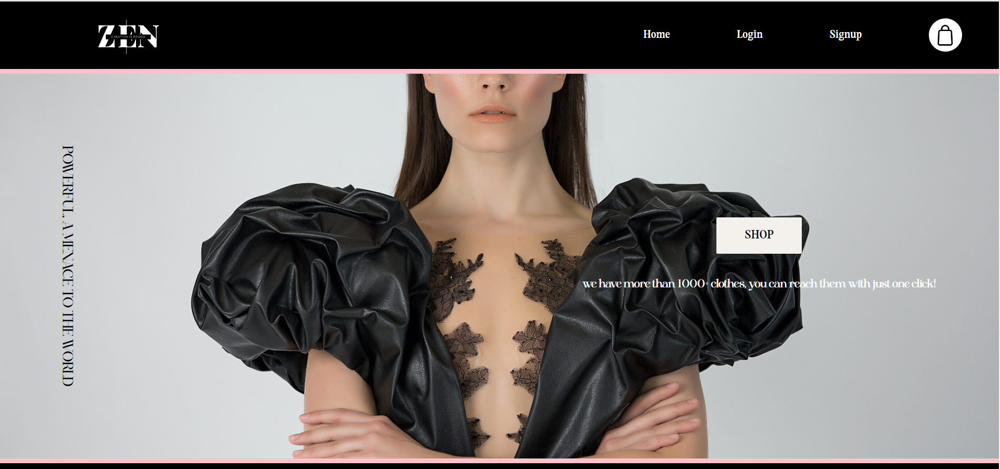
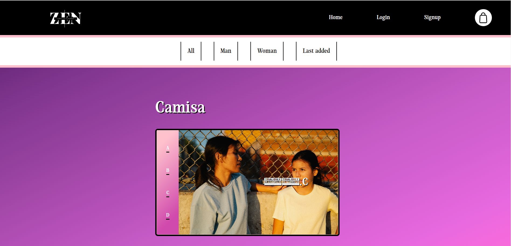
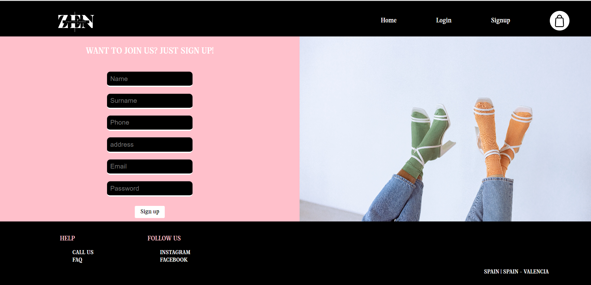
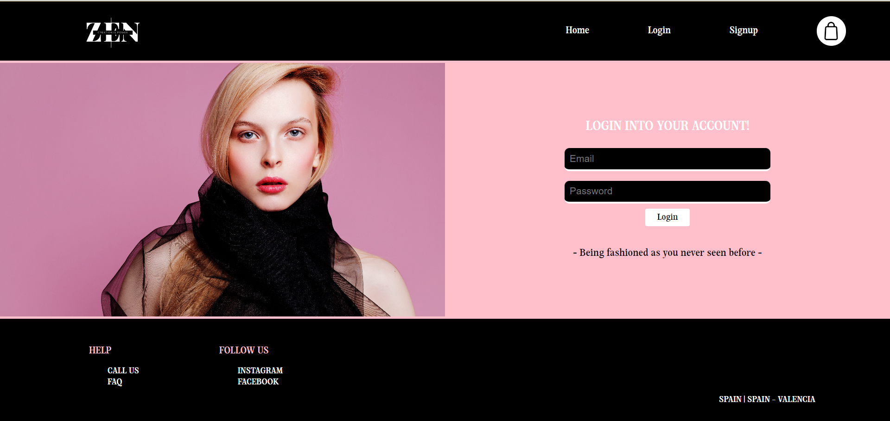
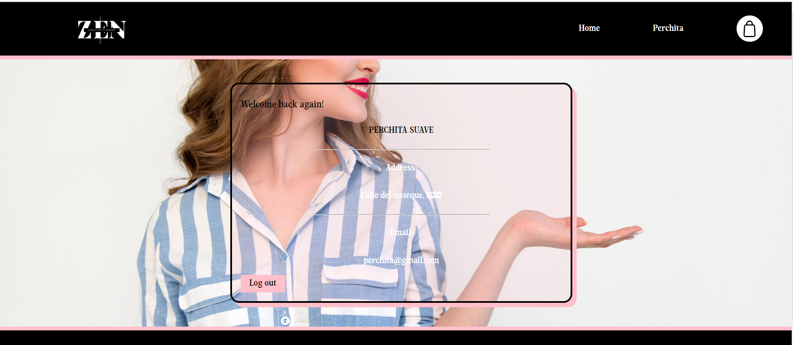

|    |     |      |

<h1 align="center">👔​​ ZEN, Ecommerce 👗​​</h1>

<h1 align="center"></h1>
<h3 align="center"><em style="color: #ba932f" >Created by: Jackson Almeida</em></h3>

<h2>🚩​​ Intro</h2>

  <a href="">Description</a> 
    
  <a href="">Pages</a> 
   
  <a href="">improvements</a>

<h2>📝​ Description</h2>
 

***ZEN*** is an Ecommerce shopping. It gives clothing services, where you can purchase any wear.

 

<h2>❓​ Pages</h2>

| Page | Screenshoot |Description |
|:-----:|:----:|:----:|
| Home |  |Main page, from here to can reach to any of our services. |
| Shopping |  |Here you can reach to any clothing, and purchase any of tem (Must be logged in to purchase it!) |
| Sign up |  |Sign up form, to register in our app. |
| Login |  |Log in form, to enter in our app and be able to purchase. |
| Profile |  |Profile from user, where you can see your info and also be able to log out.|

<h2>😭 Improvements</h2>
- More regulations would be necessary.
 
 
- Consuming more endpoints, to make it more usable, and more robust.
 
 
- To flat more our styling, and fonts. This would make the app more visualy gentle and easier to understand where you can go and do.
 
 
- Shopping cart is not done yet, due to lack of time. But you can purchase one by one.
 

 
<h2>​​🖐️🖐️​</h2>
<h2>Thank you for visiting!</h2>